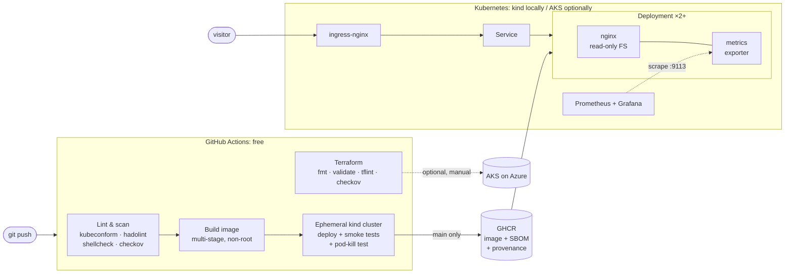

# portfolio-platform

[](https://github.com/NeoSlinkee/portfolio-platform/actions/workflows/ci.yml)
[](https://github.com/NeoSlinkee/portfolio-platform/actions/workflows/terraform.yml)

This repo is the production-style Kubernetes platform for my portfolio site, [maarsch.net](https://maarsch.net).

The site ([NeoSlinkee/portfolio](https://github.com/NeoSlinkee/portfolio)) is packaged as a hardened container and deployed with Kustomize. Every commit is tested end to end on a real multi-node Kubernetes cluster inside GitHub Actions. The same manifests target **Azure Kubernetes Service**, and the AKS infrastructure is defined in Terraform with Entra ID RBAC, workload identity, Azure CNI Overlay with Cilium, and GitHub OIDC deployments.

> **Runs for R0.** Everything here runs on a local [kind](https://kind.sigs.k8s.io/) cluster and in free GitHub Actions minutes. The Azure stack is linted, validated and security-scanned on every change, but it is **never applied automatically**, so no cloud bill is created.

---

## Architecture



## What it demonstrates

| Area | How it is done here |
|---|---|
| **Containers** | Multi-stage build (Node → nginx-unprivileged). Runs as non-root UID 101 on port 8080 with a read-only root filesystem. SPA routing, immutable caching for hashed assets, gzip. |
| **Kubernetes** | Kustomize base plus `kind` and `aks` overlays. Rolling updates with `maxUnavailable: 0`, a preStop drain, startup/readiness/liveness probes, requests and limits, an HPA (2 to 5 replicas), a PodDisruptionBudget and topology spread across nodes. |
| **Security** | Pod Security Admission `restricted`, all capabilities dropped, seccomp `RuntimeDefault`, no service account token, default-deny NetworkPolicies, and a strict CSP plus security headers. checkov runs on K8s, Docker and Terraform, and every exception is documented inline. |
| **CI/CD** | GitHub Actions lints and scans, builds, creates a 3-node kind cluster, deploys, runs HTTP smoke tests, kills a pod to prove self-healing without downtime, then publishes to GHCR with an SBOM and build provenance. |
| **Infrastructure as Code** | Terraform for AKS: VNet and subnet with an NSG, Free-tier control plane, Azure CNI Overlay with the Cilium dataplane, Entra ID and Azure RBAC with local accounts disabled, OIDC issuer and workload identity, Azure Policy, auto-upgrade channels, an API server IP allow-list, and a budget alert. |
| **Keyless deploys** | GitHub → Azure via OIDC federation. There are no stored cloud secrets, and the deploy identity can write only to the `portfolio` namespace. |
| **Observability** | An nginx Prometheus exporter sidecar, a ServiceMonitor, alert rules (site down, degraded replicas, crash-looping) and a Grafana dashboard provisioned as code. |

## Quick start (local, free)

**Prerequisites:** [Docker](https://docs.docker.com/get-docker/), [kind](https://kind.sigs.k8s.io/docs/user/quick-start/#installation), [kubectl](https://kubernetes.io/docs/tasks/tools/) and `make`. [Helm](https://helm.sh/docs/intro/install/) is only needed for monitoring. On Windows, run everything from WSL2 with Docker Desktop.

```bash
git clone https://github.com/NeoSlinkee/portfolio-platform.git
cd portfolio-platform

make up          # create a 3-node cluster, build the image, deploy, smoke test
```

Open **http://portfolio.localtest.me:8080**. (`*.localtest.me` is public DNS that always points to 127.0.0.1, so there's no hosts-file editing.)

```bash
make test        # re-run the smoke tests
make monitoring  # Prometheus + Grafana with the portfolio dashboard and alerts
make lint        # validate manifests, Dockerfile and scripts
make down        # delete the cluster
```

The site source is cloned automatically to `../portfolio` if it isn't already there. Set `APP_SRC=/path/to/portfolio` to use an existing checkout.

### What `make up` checks

The smoke tests go through the ingress controller, the same path a real visitor takes:

- `/healthz`, the home page and a client-side deep link all return 200 (SPA fallback works)
- hashed JS bundles are served with `immutable` caching, and `index.html` is `no-cache`
- CSP, `X-Frame-Options`, `nosniff` are present and the nginx version is hidden
- `/stub_status` (internal metrics) is **not** reachable from outside the pod

## Repository layout

```
app/                    Dockerfile + nginx config (security headers, SPA routing, health, metrics)
k8s/base/               Namespace, Deployment, Service, Ingress, HPA, PDB, NetworkPolicies
k8s/overlays/kind/      Local/CI environment
k8s/overlays/aks/       Azure environment: TLS via cert-manager + Let's Encrypt, strict spreading
cluster/                kind cluster definition (1 control plane + 2 workers)
monitoring/             kube-prometheus-stack values, ServiceMonitor, alerts, Grafana dashboard
infra/terraform/aks/    AKS, networking, GitHub OIDC identity, budget alert
scripts/                up / build / deploy / smoke-test / monitoring / down / bootstrap-aks
.github/workflows/      ci.yml, terraform.yml, deploy-aks.yml (manual, optional)
```

## CI/CD pipeline

| Workflow | Trigger | What it does |
|---|---|---|
| `ci.yml` | every push and PR | **lint:** render overlays, kubeconform (including CRDs), hadolint, shellcheck, checkov → **e2e:** build image, create a kind cluster, install ingress-nginx, deploy, smoke test, delete a pod and assert the site never returns a non-200 → **publish** (main only): push to GHCR tagged with the commit SHA, with SBOM and provenance attestations |
| `terraform.yml` | changes under `infra/` | `terraform fmt`, `init -backend=false`, `validate`, tflint with the azurerm ruleset, checkov. No credentials needed. |
| `deploy-aks.yml` | manual only | Azure login via OIDC, then `kubectl set image` and wait for rollout. Skipped unless AKS repo variables exist. |

## Running it on Azure (optional, **costs money**)

The AKS control plane is free on the Free tier, but the node VM, its disk and the public load balancer are billed while they exist. That's why nothing here applies the stack automatically. If you want a live demo (for an interview, say), the flow is:

```bash
cd infra/terraform/aks
cp terraform.tfvars.example terraform.tfvars   # set subscription, your IP, budget email
terraform init && terraform apply              # ~10 minutes
../../../scripts/bootstrap-aks.sh              # ingress-nginx, cert-manager, app
# point k8s.maarsch.net at the printed IP; Let's Encrypt issues the certificate
terraform destroy                              # as soon as the demo is over
```

Check current prices with the [Azure pricing calculator](https://azure.microsoft.com/pricing/calculator/) before applying. The Terraform includes a resource-group budget with alerts at 50/80/100%. Budgets alert but don't stop spend, so `destroy` is the real cost control.

## Design decisions

- **kind for CI and local, AKS as the target.** A real multi-node cluster in every CI run catches manifest, probe, ingress and NetworkPolicy mistakes that YAML linting can't, at zero cost. The overlays keep the environment differences small and explicit.
- **Kustomize over Helm for the app.** It's one app with two environments, so plain patched YAML is easier to review than a templated chart. Helm is still used for third-party components (ingress-nginx, cert-manager, Prometheus).
- **Immutable SHA tags.** Every image is tagged with its commit, so a rollback is `kubectl set image` to a previous SHA.
- **Namespace-scoped deploy identity.** CI can change the app but cannot touch the cluster, the ingress controller or other namespaces. Cluster-level setup is a separate, human-run bootstrap.
- **Azure CNI Overlay + Cilium.** Pod IPs don't consume VNet address space, and the default-deny NetworkPolicies are actually enforced by eBPF.
- **Documented security exceptions.** Controls that cost money on AKS (private cluster, Log Analytics, CMK disk encryption, paid SLA) or that conflict with upstream images are skipped with a written reason next to the code, not silently ignored.

## Roadmap

- [ ] GitOps with Argo CD (pull-based deploys instead of `kubectl` from CI)
- [ ] Sign images with cosign (keyless) and verify signatures at admission
- [ ] Kyverno policies (require signed images, disallow `:latest`)
- [ ] Remote Terraform state in Azure Storage with state locking
